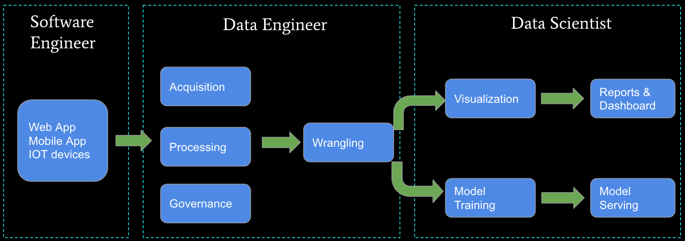

# Kaan Ozbudak - Cloud Data Engineer

## Work Life

- *ciceksepeti.com / mizu.com* - Cloud Data Engineer (April21-?)
- *iyzico.com / payu.com* - Data Engineer (Dec20-April21)
- *gtech.com* - Big Data Consultant

## Education

- Bahcesehir University - MBA (2020-?)
- Istanbul Aydin University - CENG (2015-2020)

## Social Media Links

- [kaanozbudak.com](https://kaanozbudak.com)
- [linkedin.com/in/kaanozbudak](https://linkedin.com/in/kaanozbudak)
- [instagram.com/kaanozbudakcom](https://instagram.com/kaanozbudakcom)
- [twitter.com/kaanozbudakcom](https://twitter.com/kaanozbudakcom)
- [github.com/kaanozbudak](https://github.com/kaanozbudak)

## Interesting Tech Stack

- Airflow, Kafka, Confluent Cloud and Self managed Kafka connectors, mongodb, mysql, mssql, cdc events, batch jobs ,
  DataOps, ETL, CircleCİ, Centos&Ubuntu, Git&CI/CD, Jira
- Google Cloud Techs such as:

  - Cloud Composer (Airflow), Cloud Function, PubSub, Cloud Run, Cloud Storage, MemoryStore, Container Registry, Cloud
    Load Balancer, Api Gateway, IAM etc.
- Amazon Cloud Techs such as:

  - Lambda, ECR, ECS, LB, SES, Dynamo, SAR, S3, RDS, Gateway, Route 53

## Data

- What is data? What is big data? Importance of data.
- Data types, data collection
- Database Types (Relational/Non Relational Databases) - DWH Types
- Cloud vs OnPrem
- Realtime Streaming vs Batch Streaming / ETL
- Database Admin vs Data Engineer vs Data Analyst vs Data Scientist

- Who needs Data Engineer? Why?
- What should we do become a data engineer?
- Data Engineering Road Map: [github.com/datastacktv/data-engineer-roadmap](https://github.com/datastacktv/data-engineer-roadmap)
